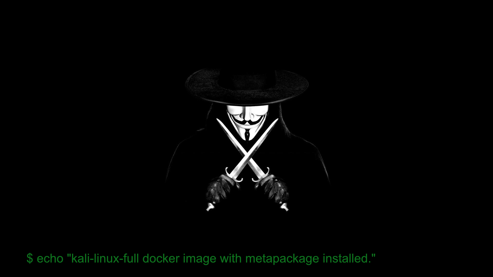

#  Kali Linux Full Docker Image



## Usage

### Build images:

```sh
# Build kali-linux-full docker image
./build-image.sh

# Build docker image with VNC server
cd vnc && ./build-image.sh
```

### Run docker container:

```sh
# Run kali-linux-full
./run.sh

# Run kali-linux-full with VNC. 
# Access at http://localhost:6080/vnc.html
# Default password: p@ssw0rd
./run-vnc.sh

# Run clean kali
./run-base.sh
```

